# stm32-motor-pid

#### 介绍
从PWM输出、正交编码器测速到PID速度环、位置环、串级控制...

#### 板子信息

本项目使用STM32F407VET6开发板进行实验

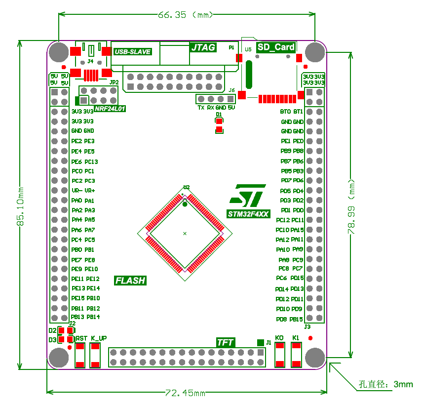

#### 项目结构

预先阅读文章：[编码器计数原理与电机测速原理——多图解析](https://zhuanlan.zhihu.com/p/350368518)
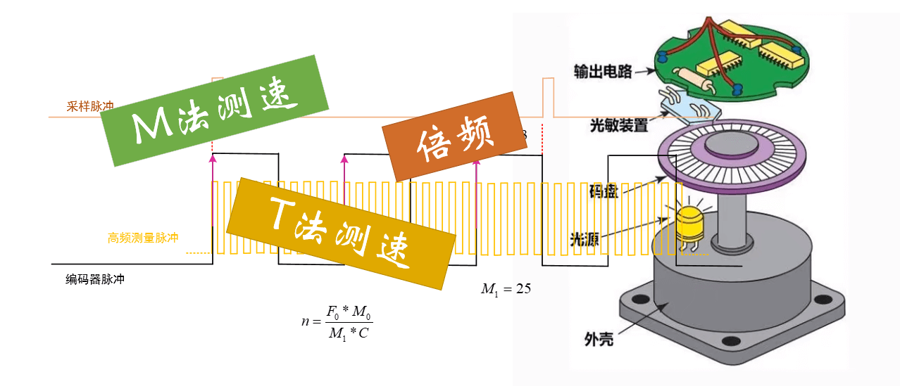

#####  实验1 PWM输出实验

文章：[电机控制基础——定时器基础知识与PWM输出原理](https://zhuanlan.zhihu.com/p/351564974)
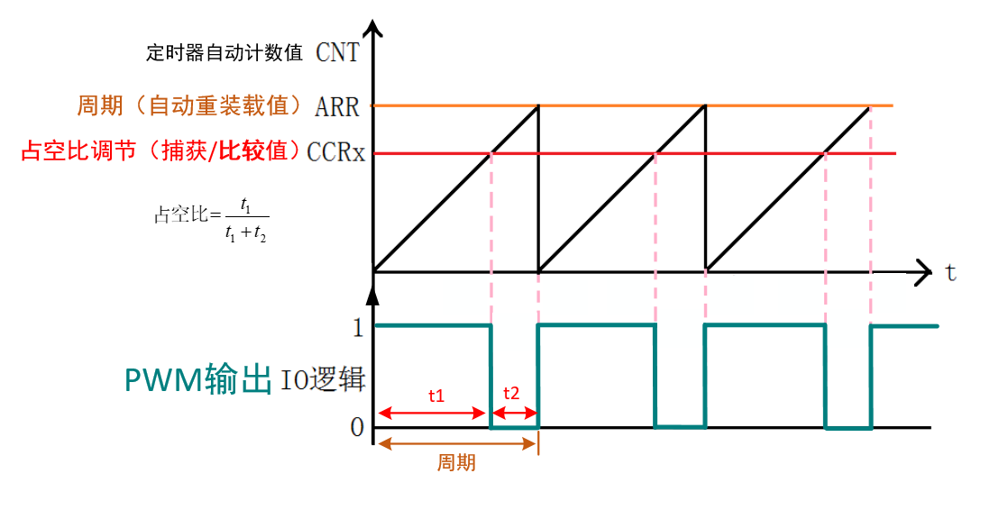

#####  实验2 输入捕获实验

文章：[电机控制基础——定时器捕获单输入脉冲原理](https://zhuanlan.zhihu.com/p/353482805)
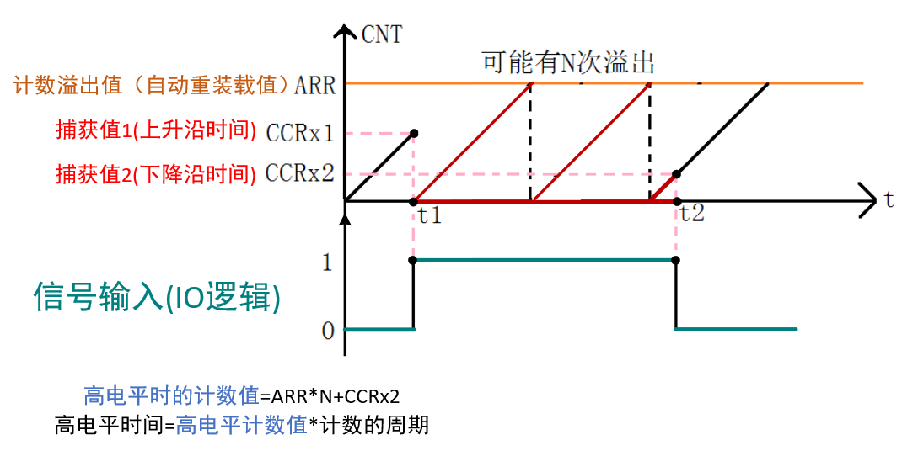

#####  实验3 正交编码器实验

文章：[电机控制基础——定时器编码器模式使用与转速计算](https://zhuanlan.zhihu.com/p/355346491)

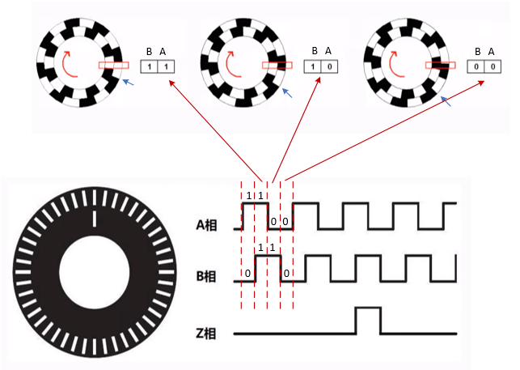

视频：<https://www.bilibili.com/video/BV13p4y1h7F9?share_source=copy_web>
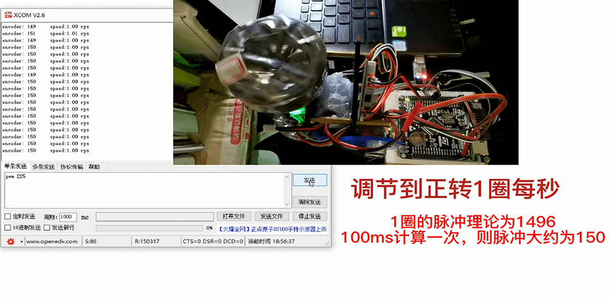

#####  实验4 速度控制PID

文章：[电机控制进阶1——PID速度控制](https://zhuanlan.zhihu.com/p/373402745)

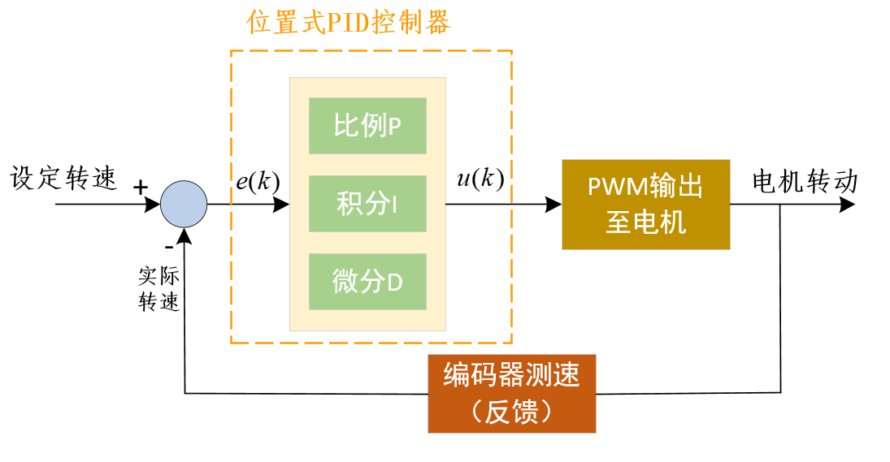

视频：<https://www.bilibili.com/video/BV18Q4y1R7e8?share_source=copy_web>
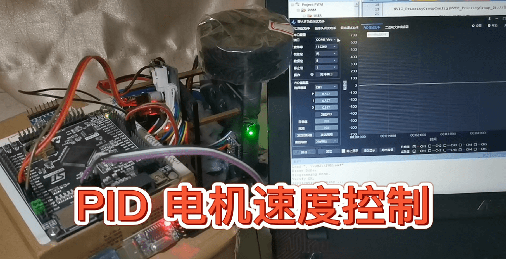

#####  实验5 位置控制PID

文章：[电机控制进阶2——PID位置控制](https://zhuanlan.zhihu.com/p/374961047)

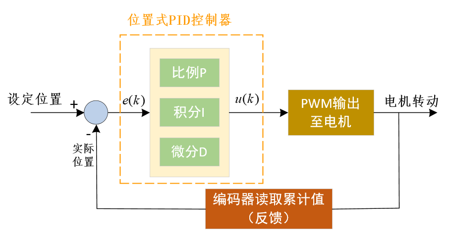

视频：<https://www.bilibili.com/video/BV1ZK4y1976i?share_source=copy_web>
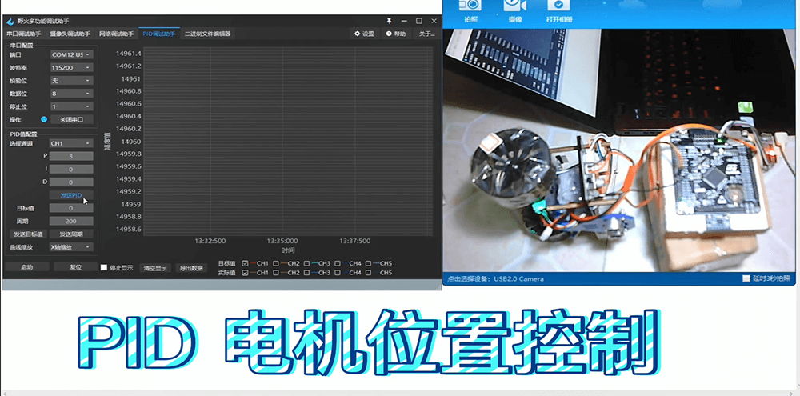

#####  实验6 串级PID 位置+速度控制

文章：[电机控制进阶3——PID串级控制](https://www.bilibili.com/read/cv11722924)

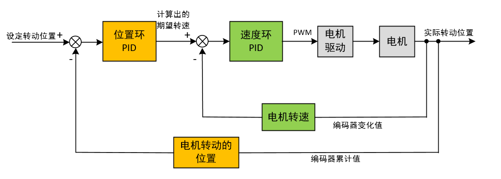

视频：<https://www.bilibili.com/video/BV1QK4y1g7yg?share_source=copy_web>
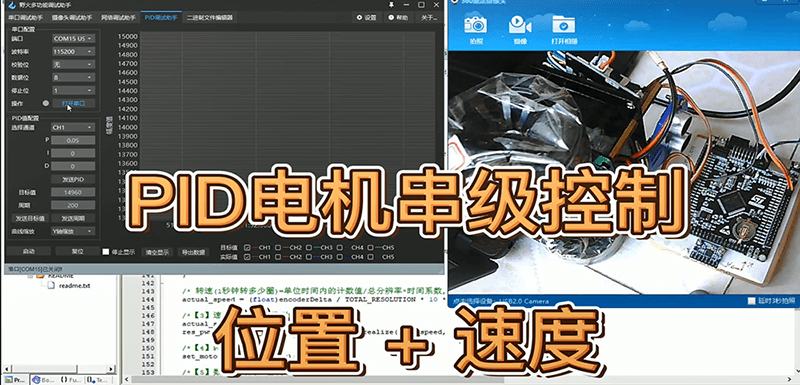

#### 野火上位机串口协议介绍

文章：[电机PID控制补充篇-野火上位机串口协议介绍](https://www.bilibili.com/read/cv17179003)

串口协议的定义参考野火论坛的介绍：<https://www.firebbs.cn/forum.php?mod=viewthread&tid=29923&extra=page%3D1>

##### 指令包格式

串口数据是通过一包一包的数据发送的，每一包的数据格式如下：

| 字节数     | 名称     | 内容           |
| ---------- | -------- | -------------- |
| **4bytes** | 包头     | **0x59485A53** |
| 1bytes     | 数据通道 | 0xXX           |
| **4bytes** | 包长度   | 0xXXXXXXXX     |
| 1bytes     | **指令** | **0xXX**       |
| 1bytes     | 参数1    | 0xXX           |
| ...        | ...      | ...            |
| 1bytes     | 参数n    | 0xXX           |
| 1bytes     | 校验和   | 0xXX           |

说明：

1. 所有多字节的**低字节**在前（关于高低字节或数据大小端的介绍，可参考：）
2. 包头固定为四字节的**0x59485A53**
3. 通道地址1到5对应软件上的CH1到CH5，**CH1为0x01**，CH2为0x02
4. 包长度为从包头到校验的**所有数据长度**
5. 指令为相应的**功能码**
6. 参数为指令**需要参数时加入**
7. 校验为校验和方式——8位

##### 指令分类

上述数据格式中，需要重点关注的是“指令”这一字段，它表明了这一包数据的具体含义。

另外，串口数据包括**下发数据**和**上传数据**，下发数据就是野火PID助手按照协议包格式向板子发送串口数据，上传数据就是板子按照协议包格式向野火PID助手送串口数据。

###### 下发数据

野火PID助手**下发**设定的数据或指令到板子中

| 功能   | 指令     | 参数     |
| ------ | -------- | -------- |
| PID    | **0x10** | 3个float |
| 目标值 | **0x11** | 1个int   |
| 启动   | **0x12** | 无       |
| 停止   | **0x13** | 无       |
| 复位   | **0x14** | 无       |
| 周期   | **0x15** | 1个uint  |

###### 上传数据

板子**上传**数据或指令到野火PID助手

| 功能   | 指令     | 参数     |
| ------ | -------- | -------- |
| 目标值 | **0x01** | 1个int   |
| 实际值 | **0x02** | 1个int   |
| PID    | **0x03** | 3个float |
| 启动   | **0x04** | 无       |
| 停止   | **0x05** | 无       |
| 周期   | **0x06** | 1个uint  |

#### 软件工具

tools文件夹下：

- 野火多功能调试助手（可以调试PID）
- 正点原子的XCOM串口助手

#### 推荐学习

- B站相关视频：<https://space.bilibili.com/146899653>
- 个人博客：<https://xxpcb.gitee.io> ,<https://xxpcb.github.io>
- 知乎：<https://www.zhihu.com/people/xxpcb>
- 微信公众文章：

感谢支持~

